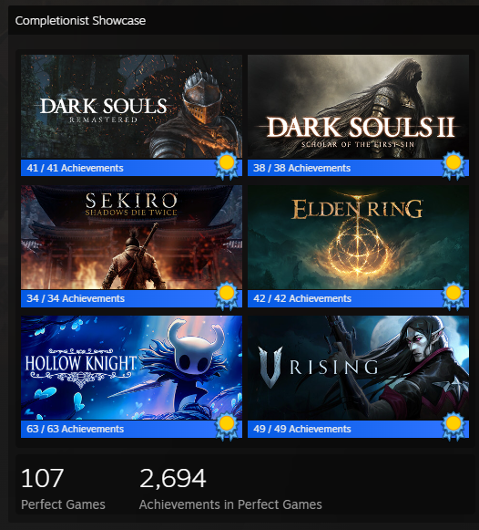
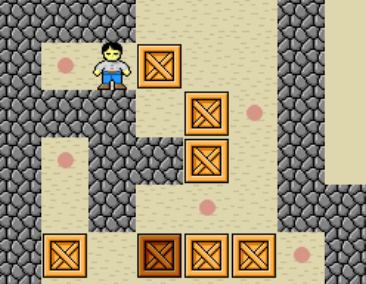
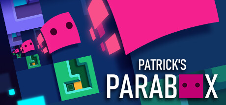
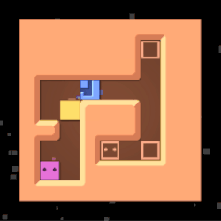
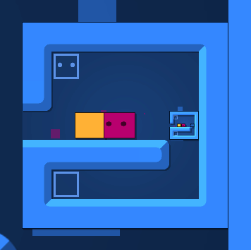

Hello, world! My name is Miko, and welcome to my first blog post! 

I am a software developer, with a background of Game Programming at George Brown College, and Software Engineering at McMaster University. For as long as I can remember, my main passion has been game development. Over the years, I’ve made various vertical slices and mechanics prototypes, and I love doing it.

Yet, I’ve never actually shipped a game from start to finish. Instead, I’ve slowly built a massive graveyard of half-finished projects.

If you're a solo developer, you probably know this struggle intimately. I absolutely adore the programming side of game development - breaking down systems into various components, solving architectural problems, mapping out logical state machines etc. But all the other stuff? Art, animation, sound design, UI, story... not a fan. 

Trying to wear all of those creative hats while staying disciplined and motivated entirely on your own is incredibly tough.

For a while, I felt like my career and my personal growth had stagnated. I wanted to move up in the world and build a portfolio to finally break into the game industry, but I lacked the motivation to start from scratch. Every time I had an idea, the sheer scope of the non-programming work paralyzed me before I could even write my first line of code.

Eventually, I had an epiphany: **Why am I trying to invent a completely original game from scratch just to practice my programming?** I should just keep it simple, and try to reverse engineer a complex game where the visuals are not the main focus. The design and the gameplay would already be defined. This gives me a highly focused, attainable goal where I can stretch my engineering muscles, solve complex problems, and document my challenges here to hopefully help and inspire other developers along the way.

### My Gaming Background

I have been a gamer since I was a kid. And when I play games, I tend to go a bit overboard, I am a massive achievement hunter.

While I love everything from grueling Soulslikes and massive JRPGs to visual novels and action-adventure games, my absolute favorite genre is what the community calls **"Thinky Games."**

If you haven't heard the term, it was coined to create a clear distinction from the massive, generic umbrella of "Puzzle" games. While a puzzle category might include things like match-three mobile games or hidden object finders, "Thinky Games" specifically focus on games that require logical deduction, rule-learning, and lateral thinking to solve. (Shoutout to the amazing community over at [ThinkyGames.com](https://thinkygames.com/) and their Discord)

I crave the raw dopamine hit that comes from solving a genuinely difficult logical puzzle. Games like _The Case of the Golden Idol_, _Return of the Obra Dinn_, and _The Roottrees are Dead_ are masterclasses in deduction that completely captured my brain.

Among thinky games, there is a subgenre I have a deep affinity for: **Sokoban** games.

At its core, a Sokoban game is a game where you move on a grid, and you push boxes to achieve some sort of goal. It is absolutely mind-blowing how developers can take that one basic interaction and expand it into incredibly complex, brain-melting puzzles.

This brings me to the star of the show.
### The Target: Patrick's Parabox

I recently beat Patrick's Parabox and got all achievements, and I have not been able to stop thinking about it since. 

On the surface, it’s a standard block-pushing game. You push a box onto a goal, and you stand on your own goal to win. There is also a unique mechanic where you can actually enter these boxes too, or even push other boxes into them as seen in the gif below.

But then, the game introduces **recursion**.

The game takes this entry mechanic and pushes it to its absolute logical limit by introducing **self-referential boxes**—boxes that contain the _exact level you are currently standing in_.

Because every single layer is linked in real-time, entering one of these boxes creates a spectacular infinite loop. When you push yourself into the self-referential box, the camera stays anchored to your room, but you watch three things happen simultaneously: your local character slides into the small box, a microscopic clone of you slides into the nested box inside _that_ one, and a colossal, giant version of your character descends from the ceiling straight into your current room!

Similarly, if you push a box out of the outer boundaries of your current grid, a giant version of that box suddenly erupts out of the self-referential block right next to you.

The first time I encountered this, I was just so impressed and got excited thinking about the countless ways this game was going to use this mechanic to blow my mind. My software developer brain also started pondering how this was implemented. 

When the game eventually introduced self-referential paradox loops (where Box A is inside Box B, but Box B is also inside Box A), I knew I had to figure out how this worked under the hood.

My goal is set: **I am rebuilding Patrick's Parabox from scratch in Unity.**

### The Plan

First I had to come up with a rough roadmap to tackle building this recursive madness:

1. Create a Minimum Viable Product of a Sokoban game:
	- Create a grid system and implement grid movement
	- Implement wall/obstacle detection and box pushing
	- Implement win conditions
	- Bonus: Implement Undo/Reset buttons
	
2. Implement Enterable Boxes
	- Implement a transition system for entering and exiting nested boxes (this must dynamically scale to support boxes inside of boxes inside of boxes).
	- Set up camera system for entering/exiting boxes
	- Write strict recursion depth limits to prevent stack overflows.
	
3. Implement Self-Referencing Boxes
	- Implement logic for interactions with self-referencing boxes
	- Set up a rendering system to preview the active, real-time inside of a self-referencing box on its outer faces.
	- Implement the "void" (a state that occurs when you push a self-referencing box out of itself)
	
4. Create Level Editor and Level Hub
	- Set up a serialization system to save levels created in the Unity editor so they can be loaded dynamically.
	- Treat individual puzzle grids as modular "blocks" that can be nested inside other levels.
	- Recreate the first couple of worlds from the original game to test the engine.

This is the plan for now, wanted to make sure I could build a rock-solid foundation before I get into the more complicated mechanics, and actually I already got started with the first step!